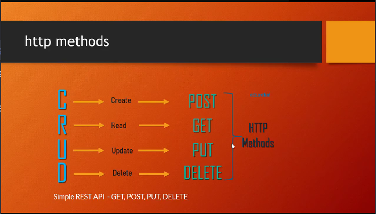

# Express JS 

## Topic Coverd
    1. Introduction to Express.js
    2. Create Express Server
    3. 

#### What is express.js and why express js?
=> 
    1. Framework for nodejs, helps to create and maintain server side coding more easily with less effort.
    2. Helps to write most of the logic in the server side, REST API for mobile, desktop, web
    3. Easy to learn

===================================
### Lesson -1 Create Express Server

===================================
### Lesson -2 HTTP methods and postman

HTTP Methods  

HTTP methods example applied and postman installed, just go to lesson-1 src

=====================================
### Lesson -3 Express Router and Route

to use expres router need to import router from -> express.Router()
then use like that ->
router.get(...)
router.post(...)

** It's recomonded to create a diffrent folder for routing coz there can be lot of route so if we write all the code in app.js it will be mess up.

After writing route in route file then export that file route and inclune or require to app.js file and add app.use(thename using you imported the route)

===========================================================
### Lesson -3 HTTP Response

    1.Body can contain data as HTML, text, JSON etc
    2. cookies
    3. Headers
    4. Status code

